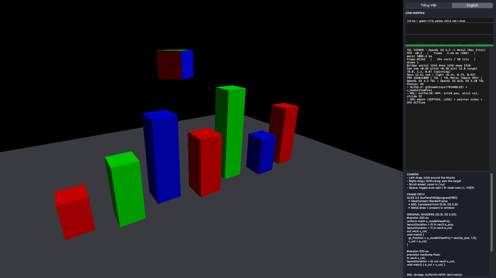
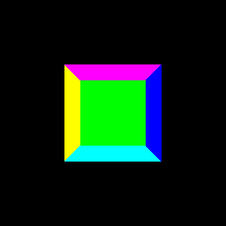
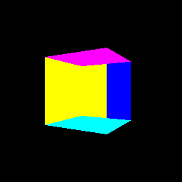
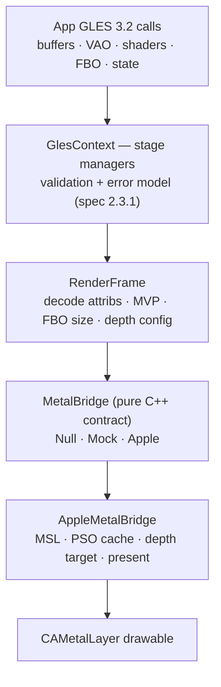
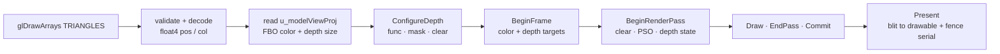

# TGL — OpenGL ES 3.2 → Metal

A test-first **OpenGL ES 3.2 implementation that executes on Metal**.
App code talks GLES 3.2; TGL validates the state machine, translates the
frame (GLSL ES → MSL) and draws it through a real `CAMetalLayer` —
on macOS today, on iOS by the same core.

> Communication: Vietnamese · Code and docs: English + Vietnamese.
> Test status: **252 tests, 2496 checks, 0 failures** · device-verified on
> Intel Mac · headless trial PASS.



*Interactive viewer (`tgl_viewer`): 7 lit RGB pillars + spinning cube on
Metal, 60 FPS, live metrics panel.*




*Headless trial (`tgl_cube_trial`, 256×256): the same pipeline renders
offscreen — rotation proven by checksums, not by looking.*

## Highlights

- **Full ES 3.2 core state**: 358 entry points, 13 enable caps, 6 shader
  stages, textures/ASTC, samplers, FBOs/MRT, sync/queries/KHR_debug,
  transform feedback, pixel paths, EGL 1.5 (46 funcs).
- **Real GPU depth**: `DEPTH_TEST` (all 8 funcs) + write mask + clear
  value, Depth32Float target, dedicated depth PSO — overlap proven by
  pixels with draw order working *against* the expected winner.
- **Real present**: offscreen render target blitted into the window
  drawable every frame; fence serials model `glFinish`/swap ordering.
- **Portable core**: pure C++17, no platform headers — the same code
  builds for macOS Intel, `iphoneos` and `iphonesimulator`.
- **Bilingual everything**: test window (VI/EN toggle) and docs
  (`/vi/` + `/en/`), all-text docs with zero images.

## Architecture



One frame through the bridge:



## Quick start

Prerequisites: macOS with Xcode (Metal SDK), `cmake >= 3.20`, a GPU.

```sh
cmake -S . -B build -DCMAKE_BUILD_TYPE=Release
cmake --build build
ctest --test-dir build --output-on-failure   # 252 tests, ~0.3 s
```

Run the interactive viewer (own window, orbit camera, live metrics):

```sh
cmake --build build --target tgl_viewer
./build/tgl_viewer
```

Run the headless proof (writes `build/cube_frameN.ppm`):

```sh
cmake --build build --target tgl_cube_trial
(cd build && ./tgl_cube_trial)
```

iOS cross-compile check (compile only):

```sh
cmake -S . -B build-ios-dev -DCMAKE_SYSTEM_NAME=iOS \
  -DCMAKE_OSX_SYSROOT=iphoneos -DCMAKE_OSX_ARCHITECTURES=arm64 \
  -DCMAKE_OSX_DEPLOYMENT_TARGET=14.0
cmake --build build-ios-dev
```

Docs (Docsify, bilingual):

```sh
docsify serve docs   # http://localhost:3000
# or: python3 -m http.server 3000 --directory docs
```

## Repository layout

```text
TGLES/
  apps/                  # tgl_viewer.mm (Cocoa window) · tgl_cube_trial.mm
                         # cube_model.h · cube_render.h (CPU lit-frame builder)
  include/tgles/         # Public headers, one topic per file (pure C++)
  src/                   # Managers (test-first) · metal_bridge_apple.mm (all MTL calls)
  tests/                 # 252 tests, incl. test_depth_buffer.cpp + test_metal_device.mm
  docs/                  # Docsify site, bilingual vi/en, all-text, zero images
    reference/           # Downloaded specs + Khronos headers (test evidence)
  assets/screenshots/    # PNG illustrations used by this README
  plan/                  # Original project plan (input, not gospel)
```

## Test coverage map

| Test file | What it proves |
|-----------|----------------|
| `test_spec_coverage.cpp` | 358 core entry points present in `gl32.h` |
| `test_negative_api.cpp` | Non-core EXT entry points rejected |
| `test_query_targets.cpp` | Spec Table 4.2 async queries |
| `test_shader_language.cpp` | GLSL ES 3.20 versions + shader stages |
| `test_pipeline_stages.cpp` | Programmable pipeline + compute |
| `test_state_machine.cpp` | Enable caps, depth-range/viewport split |
| `test_texture_formats.cpp` | Formats, ASTC, render targets |
| `test_metal_mapping.cpp` | GL → Metal mapping table |
| `test_metal_feature_matrix.cpp` | Apple GPU families (May 2026 tables) |
| `test_msl_translation.cpp` | Corrected GLSL → MSL example |
| `test_plan_consistency.cpp` | Timeline / conformance / ANGLE claims |
| `test_step01…step10` | Foundation → facade, one file per step |
| `test_mobilegl_*`, `test_egl_layer.cpp` | MobileGL host gates, EGL 1.5 (46 funcs) |
| `test_cts_subset.cpp` | Khronos CTS ES32-group subset |
| `test_border_clamp.cpp`, `test_copy_image_3d.cpp` | Border color, 3D/array copies |
| `test_cube_model.cpp`, `test_cube_render.cpp` | Test model math, lit painter sort |
| `test_render_frame.cpp` | VAO/FBO state → bridge frame (Mock) |
| `test_depth_buffer.cpp` | Depth state, FBO depth wiring, DepthConfig contract |
| `test_metal_bridge.cpp` | Null/Mock contract (PSO, encoder order, serials) |
| `test_metal_device.mm` | Real MSL/PSO/depth/draw/present/pixels (skips without GPU) |

## Compatibility

| Platform | Status | Notes |
|----------|--------|-------|
| macOS Intel x86_64 | Verified | All 252 tests + trial + viewer on macOS 15, Intel GPU |
| Apple Silicon | Untested | Same portable path expected, no machine to prove it |
| iOS device (A-series) | Compile only | `iphoneos`/`simulator` builds clean; on-device run pending |
| GPU families Apple3–Apple10 | Encoded + gated | BC = Apple9+, mesh = Apple7+, from May 2026 tables |

Requirements: Xcode with Metal SDK, CMake ≥ 3.20, a real GPU for the
device tests and the viewer (VMs fall back to deterministic skips).

## Strengths & limits (honest)

Strengths: test-first with spec citations; real-pixel proofs instead of
screenshots-of-faith; portable core with all platform code in one `.mm`;
deterministic Mock bridge so CI without GPU stays green; bilingual UI.

Limits: draw path is `TRIANGLES` with float attribs only (no indexed /
non-float / non-interleaved draws yet); no stencil *testing* (combined
attachments lend their depth aspect); no MRT or multisample resolve in
the bridge; no standalone `glClear` path (depth/color clear at pass
start); CPU painter sort retained under the depth test; clip-space z
must be in **[0, 1]** — GL-style negative z is clipped by Metal before
the depth test runs (probed, documented, tested).

## Credits

- **Khronos Group** — OpenGL ES 3.2, GLSL ES 3.20, EGL 1.5 specifications
  and headers in `docs/reference/` (verification ground truth).
- **Apple** — Metal API + Metal Feature Set Tables (May 2026).
- **MobileGL-Dev / MobileGlues / PojavLauncher iOS** — host-contract
  research (DirectGLES loader, EGL surface, CPS substrate notes).
- **Docsify.js** — bilingual docs site.
- No third-party code is vendored; `docs/reference/` holds specs and
  headers only.

## License

MIT — see [LICENSE](LICENSE). Redistribution must keep the copyright
notice (i.e. credit back to this project).

## Tóm tắt tiếng Việt

TGL là implementation OpenGL ES 3.2 chạy thật trên Metal: code test-first
(252 tests, 0 failures), state machine đầy đủ, dịch GLSL ES sang MSL,
depth test thật trên GPU, present ra cửa sổ macOS hoặc chạy headless.
Core C++ thuần portable cho iOS; đã kiểm chứng trên Mac Intel, có cửa sổ
test tương tác (kéo-xoay cam, FPS, biểu đồ, song ngữ VI/EN) và docs song
ngữ không dùng ảnh. Giới hạn đã ghi rõ ở bảng trên.