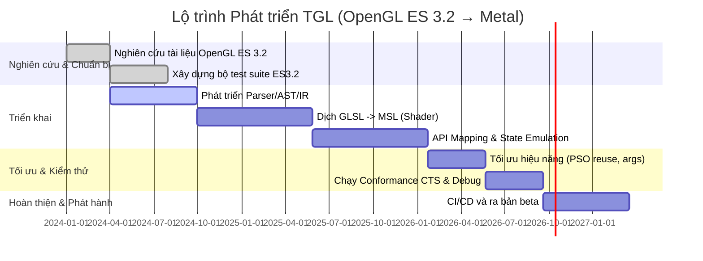
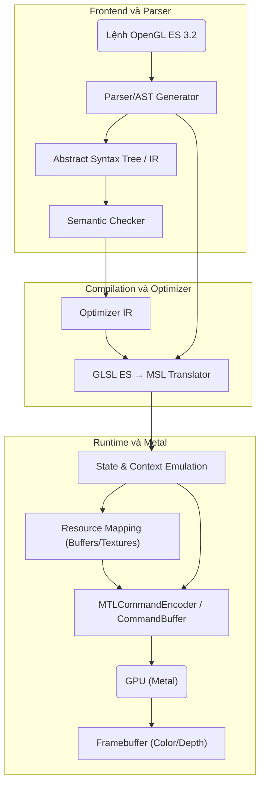

# Bản tin tóm tắt (Executive Summary)  
Báo cáo này tổng hợp đầy đủ các tài liệu chính thức về OpenGL ES 3.2 (spec, GLSL ES 3.20, tài liệu Khronos, whitepapers, v.v.) theo các chương mục: tổng quan, surface API, ngôn ngữ shader, các giai đoạn pipeline, cơ chế state-machine, định dạng texture và nén, buffer/VAO, FBO, sync, tối ưu hiệu năng, yêu cầu tuân thủ, các trường hợp đặc biệt và hành vi driver. Dựa trên đó, báo cáo trình bày kế hoạch chi tiết phát triển **TGL** – một trình biên dịch/transpiler dịch nguyên vẹn OpenGL ES 3.2 sang Metal (iOS) trên các SoC A9…A20 (tương ứng iOS 14…27). Mục tiêu của TGL là thay thế MetalANGLE (hiện chỉ hỗ trợ ES 3.0) bằng việc triển khai đầy đủ ES 3.2 (không thiếu, không thừa), tối ưu hóa hiệu năng, và phát triển/test hoàn toàn trên macOS (Intel). Kiến trúc hệ thống gồm frontend (parser, AST, semantic), bộ tối ưu, trình dịch shader (GLSL ES→MSL), bộ mô phỏng trạng thái thời gian chạy (state emulation), ánh xạ tài nguyên, đồng bộ hóa và xử lý lỗi. Báo cáo cũng đưa ra bảng đối chiếu chi tiết API/feature GL ES sang Metal, các trường hợp không map trực tiếp (giải pháp emulation, shader rewrite, multi-pass, compute fallback), chiến lược tối ưu (tái sử dụng PSO, argument buffers, tối ưu tile-based GPU, layout bộ nhớ, định dạng texture nén), ma trận tương thích phần cứng/OS (A9–A20, iOS14–27, tính năng MSL, định dạng pixel, giới hạn GPU), kế hoạch kiểm thử (unit, tích hợp, conformance, benchmark), CI/CD trên macOS và iOS, hệ thống build, đóng gói, licensing, bảo mật. Kết quả mong đợi gồm: (1) tài liệu tổng hợp OpenGL ES 3.2; (2) kế hoạch kỹ thuật TGL chi tiết; (3) bảng so sánh API/feature mapping; (4) ma trận tương thích phần cứng/OS; (5) danh sách test case theo chương mục spec và cơ chế tự động hóa; (6) lộ trình phát triển với các mốc milestone, nhân lực và ước lượng person-month; (7) danh sách nguồn tham khảo ưu tiên (Khronos, Apple, conformance test, ANGLE, tài liệu khoa học) kèm link; (8) ví dụ minh họa chuyển mã shader (GLSL ES → MSL) với đoạn mã mẫu; (9) sơ đồ kiến trúc và biểu đồ timeline sử dụng Mermaid.  

## I. Tổng quan OpenGL ES 3.2  
OpenGL ES 3.2 (ra mắt năm 2015, bảo trì 2022) là phiên bản mới nhất của OpenGL dành cho thiết bị nhúng (mobile, embedded). Theo tài liệu chính thức, “OpenGL ES (Open Graphics Library for Embedded Systems) là một API cho phần cứng đồ họa. API này gồm hàng trăm hàm và thủ tục cho phép lập trình viên xác định shader programs, các đối tượng và phép toán tham gia tạo ra hình ảnh 3D chất lượng cao”. Mô hình chung của OpenGL ES là **pipeline** kết hợp các giai đoạn có thể lập trình (shader) và các giai đoạn cố định điều khiển bằng trạng thái (fixed-function) gọi bởi các lệnh vẽ. Cụ thể, các lệnh của GL ES cho phép thiết lập context, tạo/shader, nạp dữ liệu geometry (VBO, VAO, IBO…), texture, và cuối cùng thực hiện draw calls (glDrawArrays/glDrawElements). OpenGL ES 3.2 bao gồm thêm nhiều tính năng nâng cao: **shader hình học (geometry)** và **tessellation (điều tiết lưới)** để xử lý cảnh phức tạp trên GPU; **render targets dấu phẩy động (floating-point)** cho tính toán độ chính xác cao; **nén texture ASTC** để giảm dung lượng và băng thông; hỗ trợ **hợp nhất (blending) nâng cao** và nhiều color attachments (multiple render targets); các định dạng texture mới (texture buffer, multisample 2D array, cube map array); cũng như các tính năng debugging, robustness cho phát triển code an toàn. Các tiện ích này phần lớn được lấy từ Android Extension Pack (AEP) và hiện nay đã trở thành tiêu chuẩn cơ bản.

Người lập trình GL ES 3.2 thường phải mở cửa sổ render, tạo GL context rồi gọi các hàm API để thiết lập shader, geometry, texture… rồi cuối cùng gọi các lệnh vẽ (points, line, polygon, patches nếu có tessellation) để render vào framebuffer. Các shader (GLSL ES 3.20) sẽ xử lý các stage có thể lập trình (vertex, tess control/eval, geometry, fragment, compute). Mô hình này đáp ứng nhu cầu của cả lập trình viên lẫn người triển khai, mặc dù không bắt buộc trình triển khai phải làm đúng y hệt từng bước đã mô tả miễn sao kết quả cuối cùng phải đúng.

Mô hình ngôn ngữ shader GLSL ES 3.20 (xuất bản năm 2023) quy định cú pháp/semantics của shader cho ES 3.2. ES 3.2 yêu cầu các phiên bản ngôn ngữ 3.20, 3.10, 3.00 và 1.00 được hỗ trợ. Tóm lại, OpenGL ES 3.2 gồm API đồ hoạ (các hàm `gl*`), pipeline đồ hoạ và ngôn ngữ shader bổ trợ (GLSL ES 3.20). Tài liệu chính thức chi tiết có thể tham khảo ở **Khronos Registry**, với spec ES 3.2 (5/2022) và GLSL ES 3.20 (8/2023) công khai.

## II. Tổng hợp đặc tả và tài liệu OpenGL ES 3.2  

### 1. Surface API  
OpenGL ES 3.2 định nghĩa một tập hợp hàm API phong phú, bao gồm:

- **Quản lý object và tài nguyên**: glGen*/glDelete* (textures, buffers, renderbuffers, framebuffers, samplers, queries, sync objects, v.v.), glBind*/glBindBufferRange, glBufferData/glBufferSubData (sinh khối dữ liệu cho buffer), glTexImage* (tạo texture), glRenderbufferStorage (tạo renderbuffer), glTexStorage (tạo texture immutable), glCopyImageSubData (copy giữa texture/buffer), glTexStorageMultisample, glRenderbufferStorageMultisample (texture/RBO đa mẫu), glSamplerParameteri (thiết lập sampler), v.v.  

- **Quản lý trạng thái (state machine)**: glEnable/glDisable để bật/tắt state (ví dụ GL_BLEND, GL_DEPTH_TEST, GL_CULL_FACE, GL_PRIMITIVE_RESTART, GL_PROGRAM_POINT_SIZE…), glPolygonMode (mặc dù ES3.2 chỉ chấp nhận GL_FILL), glCullFace, glFrontFace, glDepthFunc, glBlendFunc/Separate, glStencilFunc/Op, glDepthRange, glViewport, glScissor, glLineWidth, glPointSize, glPolygonOffset, glProvokingVertex, v.v. Đa số state này sẽ được lưu trong context và ảnh hưởng tới pipeline sau này. (Một số state không map thẳng sang Metal, sẽ bàn trong phần mapping sau.)

- **Vertex Input và Vertex Array Objects (VAO)**: glEnableVertexAttribArray, glVertexAttribPointer (thiết lập cách lấy attribute từ VBO), glVertexAttribIPointer, glBindVertexArray (khởi tạo VAO), glBindBuffer(GL_ARRAY_BUFFER/GL_ELEMENT_ARRAY_BUFFER). ES 3.x hỗ trợ VAO cho phép lưu nhóm thiết lập attribute, giúp tối ưu khi bind/unbind. Ngoài ra có Transform Feedback: glTransformFeedbackVaryings, glBindBufferBase(GL_TRANSFORM_FEEDBACK_BUFFER, ...), glBeginTransformFeedback/glEndTransformFeedback để ghi dữ liệu từ shader vertex/geometry sang buffer.

- **Shader Programs**: Các hàm tạo Shader/Program: glCreateShader, glShaderSource, glCompileShader, glCreateProgram, glAttachShader, glLinkProgram, glUseProgram, glGetUniformLocation, glUniform* (thiết lập uniform), glUniformBlockBinding, glBindAttribLocation, glGetProgramBinary (kết xuất SPIR-V), v.v. Với pipeline programmable, mỗi chương trình shader gắn 1 vertex shader, 0 hoặc nhiều tessellation/geometry shaders, và 1 fragment shader. ES 3.2 hỗ trợ Program Pipeline (separable program), cho phép link độc lập từng giai đoạn shader.

- **Mệnh lệnh vẽ**: glDrawArrays, glDrawElements (khi dùng index buffer), cùng với biến thể instanced glDrawArraysInstanced, glDrawElementsInstanced, glMultiDrawArrays/MultiDrawElements (nếu hỗ trợ phần mở rộng). Đối với tessellation: glPatchParameteri, vẽ bằng glDrawArrays(GL_PATCHES) nếu có tessellation. Đối với transform feedback: glDrawTransformFeedback.

- **Framebuffer Objects (FBO)**: glGenFramebuffers, glBindFramebuffer, glFramebufferTexture2D/TextureLayer/Renderbuffer (gắn attachment), glDrawBuffers, glReadBuffer (nếu có). ES3.2 hỗ trợ nhiều color attachments (GL_COLOR_ATTACHMENT0..15), định dạng texture/lõi renderbuffer khác nhau, glBlitFramebuffer (copy giữa FBO), glInvalidateFramebuffer. Rất nhiều state của FBO được quy định trong spec (bảng 21 trong spec).

- **Sync và Query**: Đối tượng Sync: glFenceSync, glWaitSync, glClientWaitSync, glDeleteSync (cho đồng bộ CPU-GPU). Query objects: glGenQueries, glBeginQuery, glEndQuery, glGetQueryObject (các loại query như GL_TIME_ELAPSED, GL_ANY_SAMPLES_PASSED, GL_PRIMITIVES_GENERATED, GL_TRANSFORM_FEEDBACK_STREAM_OVERFLOW, GL_TIMESTAMP). Atomic Counter Buffer và Shader Storage Buffer (SSBO) cho phép shader thực thi phép atomic hoặc ghi đa luồng.

- **Compute**: ES 3.1 trở lên hỗ trợ compute shader. Gọi bằng glDispatchCompute, với glDispatchComputeIndirect, glMemoryBarrier/glMemoryBarrierByRegion để đồng bộ giữa các truy xuất shader.

Nhìn chung, mặt API của ES3.2 bao gồm toàn bộ các hàm GL ES truyền thống từ phiên bản cũ (2.0/3.0/3.1), cộng thêm các hàm dành cho shader và tính năng mới (ví dụ quản lý Program Pipeline, shader storage, atomic counter, copyImage, texture multsampe array, v.v.). Tài liệu liệt kê chi tiết API và header có trên **Khronos Registry**. 

### 2. Ngôn ngữ shader GLSL ES 3.20  
OpenGL ES 3.2 sử dụng ngôn ngữ shader **GLSL ES 3.20** (phiên bản mới nhất dành cho ES 3.x). Mã shader thường bắt đầu bằng `#version 320 es` và theo cú pháp giống C/C++ mở rộng (hỗ trợ struct, array, vòng lặp, if, uniforms, sampler2D, v.v.). So với GLSL ES 3.10 (ES 3.1), phiên bản 3.20 bổ sung thêm một số tính năng mới (ví dụ layout qualifiers cho uniform/ssbo, double, int64, phiên tính toán mới, extensions, v.v.), tương thích ngược với GLSL ES 1.00/3.00/3.10 đã được spec đảm bảo. Tất cả tham chiếu về shader trong spec ES 3.2 đều dựa trên tài liệu GLSL ES 3.20 chính thức (có thể tham khảo trong registry). Bên cạnh GLSL, Metal sử dụng ngôn ngữ shader MSL (Metal Shading Language) dựa trên C++14 của Apple; TGL sẽ cần dịch các shader GLSL ES sang MSL tương ứng để chạy trên Metal, đảm bảo tính tương đương về ngữ nghĩa (cụ thể ví dụ sẽ thấy trong phần sau). 

### 3. Các giai đoạn trong pipeline (Programmable Pipeline)  
OpenGL ES định nghĩa **pipeline đồ họa** tuần tự gồm các stage chính: Vertex Shader → (Tessellation Control → Tessellation Eval → Geometry Shader) → Rasterizer → Fragment Shader → Kết quả ghi lên Framebuffer. Ngoài ra ES3.2 hỗ trợ cả Compute Pipeline độc lập. Cụ thể:

- **Vertex Shader**: xử lý mỗi đỉnh, có thể ghi ra các thuộc tính của đỉnh raster. In ES 3.2 có thể sử dụng cùng lúc nhiều vertex shader thông qua program pipeline (separate shader objects), nhưng mặc định vẫn link vào chương trình đơn.  

- **Tessellation Shader**: bao gồm hai giai đoạn: Tessellation Control (thường gọi là Hull Shader) và Tessellation Evaluation (Domain Shader). Được sử dụng để chia nhỏ patches (được xác định bởi glPatchParameteri) thành nhiều primitives con (triangle/quad) cho độ chi tiết cao hơn. Những shader này chỉ có nếu ES implement hỗ trợ AEP. Hệ thống sẽ tính toán LOD dựa trên mức chia (tessLevel), sau đó đánh index và cho từng phần vào TessEval để biến đổi. Trong Metal, từ iOS 11+ cũng có khái niệm tessellation (MTLTessellationPartitionMode) tương tự, cho phép chuyển ngữ tương đối dễ.

- **Geometry Shader**: xử lý các primitive (point/line/triangle) đã raster từ stages trước, cho phép tạo thêm đỉnh (ví dụ dựng billboard hoặc xử lý bóng điểm). Metal bản chất không có geometry shader stage truyền thống (đến Metal 3 chỉ hỗ trợ Mesh Shader như alternative), nên nếu cần tính năng này, TGL sẽ phải xử lý tùy chọn bằng nhiều pass hoặc dùng compute shaders thay thế (ví dụ nhân thêm đỉnh trên CPU hoặc compute).

- **Rasterization**: GPU chuyển primitives sang fragments (pixel). Có các quyết định như culling (glCullFace), depth test, stencil test, multisample, mượt cạnh, v.v. Pixel shader (fragment) nhận fragments và thực hiện tính toán màu (theo vật liệu, ánh sáng). Kết quả sau đó có thể được blend với frame buffer theo state blending.

- **Fragment Shader**: xử lý từng fragment, tính màu đầu ra (r, g, b, a) và optionally thay đổi độ sâu (gl_FragDepth) hoặc discard fragment. Ngoài ra ES3.2 cho phép render targets đa kênh (ghi nhiều màu cùng lúc).  

- **Compute Shader**: một pipeline riêng biệt, dùng glDispatchCompute, song song tính toán trên hệ thống GPU không phụ thuộc pipeline đồ hoạ. Các luồng tính toán có thể đọc/ghi các buffer hoặc image atomic.

### 4. Cơ chế State Machine  
OpenGL ES 3.2 hoạt động như một **state machine**: mọi context lưu trữ trạng thái hiện tại của API (shader program, buffer hiện tại, texture hiện tại cho mỗi unit, state blending/depth/etc., FBO đang active, v.v.). Mỗi lệnh `gl*` tương ứng cập nhật state này hoặc thực thi lệnh vẽ sử dụng các state đã thiết lập. Điều này tạo thuận lợi cho lập trình (có thể bật/tắt state dễ dàng), nhưng phức tạp khi dịch sang Metal vì Metal không dùng state machine toàn cục. Trên Metal, hầu hết state (blend, depth, stencil, shader, layout buffer/texture, render target, viewport, v.v.) được gói thành các *Pipeline State Object* (MTLRenderPipelineState và MTLDepthStencilState) phải tạo sẵn; giao thức gọi vẽ phải cung cấp chúng. Do đó, TGL sẽ cần duy trì một lớp logic “mô phỏng” state GL: mỗi khi lập trình viên gọi glEnable/glDisable hoặc glBlendFunc…, TGL ghi lại state đó; trước khi vẽ, TGL phải tạo/lookup MTLRenderPipelineState tương ứng với tổ hợp state hiện thời (shader, blend mode, cull, depth-test, v.v.). Ngoài ra cần chuyển đổi logic cập nhật state (ví dụ glDepthRange/DepthMask → thiết lập viewport và depth write, glStencil → MTLStencilDescriptor, glViewport/Scissor → MTLRenderPassDescriptor) sao cho tương đương về kết quả.  

### 5. Texture và định dạng nén  
OpenGL ES 3.2 hỗ trợ đầy đủ các loại texture: 2D, 3D, 2D array, 3D array (cubemap array), cubemap, cùng các biến thể multisample (2D multisample, 2D array multisample). Ngoài ra có texture buffer (tạo texture từ buffer) và texture stencil rời (OES_texture_stencil8). Ở phần nén, ES3.2 tích hợp **ASTC LDR/HDR** (Khronos ASTC) cho cả ảnh 2D và 3D, giúp giảm dung lượng so với ETC hoặc PVRTC trước đây. Nhiều chipset mobile đời mới còn hỗ trợ các định dạng phổ thông (BC/DXT) qua cập nhật. Apple GPU (iPhone) thường hỗ trợ **ASTC** và **PVRTC** sẵn, BC (DXT) chỉ hỗ trợ từ dòng A14/A15 trở đi. TGL cần ánh xạ các định dạng texture này sang Metal: Metal cũng hỗ trợ hầu hết định dạng phổ dụng (MTLPixelFormatASTC_*, PVRTC, rgba8Unorm, rgba16Float, etc.). Ví dụ, texture ASTC trên GL sẽ sử dụng MTLPixelFormatASTC_LDR_RGBA_*/ASTC_HDR tương ứng. Đối với các định dạng hiếm hơn (nếu có GL mở rộng), có thể ép kiểu (reinterpret) hoặc giải nén sang uncompressed rồi upload.  

### 6. Buffer và VAO  
OpenGL ES dùng nhiều loại buffer: **Vertex Buffer (VBO)** chứa dữ liệu đỉnh; **Element Buffer (Index Buffer)** chứa các chỉ số; **Uniform Buffer Objects (UBO)**, **Shader Storage Buffer Objects (SSBO)**, **Atomic Counter Buffer** để shader truy cập dữ liệu tập trung; **Transform Feedback Buffer** để thu kết quả từ shader đỉnh; **Texture Buffer** để texture hóa buffer; **Query objects** cho occlusion/timestamp. ES3.2 hỗ trợ glBindBufferRange/glBindBufferBase để liên kết buffer. **Vertex Array Object (VAO)** được dùng để lưu trạng thái liên quan đến glVertexAttribPointer và glEnableVertexAttribArray, giúp nhanh chóng bật tắt nhiều VBO. TGL cần ánh xạ mỗi buffer GL sang một **MTLBuffer** tương ứng (tạo qua MTLDevice.newBuffer) hoặc **MTLTexture** nếu texture buffer hoặc multisample. Ví dụ glBindBuffer(GL_UNIFORM_BUFFER) sẽ tương đương binding vào một MTLBuffer hoặc MTLBuffer tuỳ theo binding index. Với VAO, TGL có thể lưu lại cấu hình vertex attribs và nhanh chóng tái sử dụng MTLRenderPipelineState nếu cần.  

### 7. Framebuffer Objects (FBO)  
FBO cho phép render offscreen vào texture hoặc renderbuffer. OpenGL ES cung cấp glGenFramebuffers, glBindFramebuffer, glFramebufferTexture2D/Layer/Renderbuffer để gắn các attachment (color, depth, stencil). ES3.2 hỗ trợ nhiều attachment GL_COLOR_ATTACHMENT0..n và glDrawBuffers để vẽ tới nhiều target (MRT). Khi glDrawArrays/glDrawElements gọi, nếu có FBO bound, Metal TGL sẽ cần tạo một **MTLRenderPassDescriptor** chứa các **MTLRenderPassAttachmentDescriptor** tương ứng. Ví dụ glClear hoặc glBlitFramebuffer sẽ chuyển thành các hàm tương đương trên MTLCommandEncoder. Tính năng blit và read_pixels (glReadPixels) có thể dùng MTLBlitCommandEncoder để copy dữ liệu từ texture sang vùng CPU nếu cần.

### 8. Đồng bộ và Query  
OpenGL ES có các đối tượng Sync (glFenceSync, glWaitSync, glClientWaitSync) để đồng bộ GPU với CPU, và Query (glBeginQuery,…glEndQuery) cho timer, occlusion, transform feedback overflow. Metal tương tự có **MTLSharedEvent** (từ Metal2) để đồng bộ, hoặc MTLCommandBuffer.commit + waitUntilCompleted để glFinish. TGL sẽ mô phỏng glFenceSync bằng việc tạo MTLCommandBuffer, sau đó trả về handle và đợi theo yêu cầu. Các query như GL_TIMESTAMP có thể dùng MTLCounterSampleBuffer hoặc đo CPU/commandBuffer. Các query occlusion/thống kê không có API trực tiếp trong Metal, có thể bỏ qua hoặc dùng lệnh đếm primitives ở driver nếu có.

### 9. Hiệu năng (Performance)  
OpenGL ES được thiết kế cho thiết bị nhúng (như điện thoại, tablet), thường sử dụng GPU kiểu **tile-based** (PowerVR, Mali). Do đó, hiệu năng phụ thuộc vào băng thông và cách xử lý state. Các lưu ý cơ bản: **minimize state changes** (dùng ít glBind, glUseProgram; tái sử dụng VAO/UBO), **batch draw calls**, **sử dụng buffer orphaning** (glBufferData(nullptr) để đánh dấu tái cấp phát), **dùng multi-sampling hợp lý**, **tránh đọc-dữ liệu ngược** (glReadPixels tốn kém). OpenGL ES còn có các kỹ thuật mở rộng: instancing, indirect draw, texture compression, phong to phong, v.v. TGL khi chuyển sang Metal cũng phải tối ưu theo phong cách Metal: tái sử dụng **MTLRenderPipelineState** (chi phí tạo PSO cao), dùng **Argument Buffers** (cho MSL/Metal 2+ để nhóm resource), tận dụng threadgroups trong compute, giảm overhead đẩy lệnh. Bên cạnh đó, cần chú ý **tile-based rendering**: gom nhóm draw cùng FBO để tận dụng cache khối màu, tránh đọc-ghi bộ nhớ chính không cần thiết.  

Trên Metal, nhiều lệnh của GL được thực thi bằng command buffer. Ví dụ, thay vì gọi glDrawArrays nhiều lần, nên gom thành glDrawArraysInstanced nếu được, nhằm tận dụng tối đa GPU. Ở shader, cần tránh nhánh phụ nhiều (minimize dynamic branching) và sắp xếp dữ liệu bộ nhớ liên tục (interleaved vertex, uniform buffer packed) để phù hợp layout của GPU. Nói chung, chiến lược tối ưu hoá bao gồm: **tái sử dụng pipeline state và argument buffer**, **tận dụng cache tile GPU**, **tối ưu layout bộ nhớ** (ví dụ bằng `MTLTexture` ordered), và sử dụng **định dạng texture phù hợp** (VD: ASTC cho nén tốt, evitar chuyển đổi runtime).  

### 10. Yêu cầu tuân thủ (Conformance)  
Để một implementation được xem là “OpenGL ES 3.2-compliant”, nó phải vượt qua bộ **OpenGL ES 3.2 Conformance Test Suite (CTS)** do Khronos phát hành. CTS kiểm tra hàng chục ngàn trường hợp (từ API đến shader, pipeline) để đảm bảo tất cả điểm quy định trong spec đều được thực hiện đúng. Ví dụ, đến tháng 2/2024, Apple M1/M2 (theo Asahi/Mesa) đã chính thức đạt chứng nhận tuân thủ ES 3.2, chứng minh driver họ vượt qua mọi bài test. TGL cần xây dựng bộ test tương đương theo spec: các test đơn vị cho từng hàm (glBind, glEnable, v.v.), test shader, test tích hợp pipeline (render hình mẫu), và nếu có thể chạy trực tiếp DTS (CTS) của Khronos để đối chiếu. Trong kế hoạch này, dự kiến “viết toàn bộ test suite chuẩn OpenGL ES 3.2 trước khi hiện thực”, tức là phải tạo và chạy test cover từng chương mục của spec, từ các phép toán logic bitwise trong shader, đến trạng thái FBO.   

### 11. Trường hợp đặc biệt và hành vi driver  
Một số hàm hoặc hành vi GL ES không map trực tiếp sang Metal, cần lưu ý: 
- **gl_PointSize, gl_LineWidth**: Metal không hỗ trợ thay đổi kích thước điểm hoặc đường, chỉ kẻ điểm/line width=1. Giải pháp: nếu cần, shader geometry có thể tạo hai tam giác thành hình vuông (particle billboards) để thay thế điểm lớn; đường dày có thể vẽ dưới dạng hình chữ nhật từ hai tam giác.  
- **glPolygonOffset**: Metal hỗ trợ depth bias trong descriptor để tương đương.  
- **glClipControl**: không có trong ES (chỉ OpenGL desktop).  
- **gl_FragDepth**: ES cho phép ghi fragment depth; Metal yêu cầu bật tính năng tương ứng trong raster khẩu (MTLRenderPipelineDescriptor.depthAttachmentPixelFormat).  
- **Debugging/Robustness**: ES3.2 cho KHR_debug và KHR_robustness; Metal có API debug riêng, nhưng khả năng kích hoạt thông báo lỗi GL từ TGL phải tự cài đặt (ví dụ ánh xạ glGetError).  
- **Nhiều driver** (đặc biệt Android) có bug riêng: ví dụ tính năng multi-sample 2D array không phổ biến trên tất cả GPU, hoặc hỗ trợ cube map arrays kém. Cần xác nhận thông qua querying GL_MAX_* để xử lý fallback.  

Hành vi GL trên iOS cũng đặc biệt: Apple chính thức đã ngừng hỗ trợ OpenGL ES mới kể từ iOS 12, nhưng về sau Apple M1/M2 lại được chứng nhận chạy ES3.2 qua Mesa/Asahi. Do đó, phần lớn iOS mới chỉ dùng Metal; TGL phải đảm bảo chạy tốt trên thiết bị iOS khác nhau, có thể thông qua trình giả lập hoặc dưới dạng thư viện Native. Các giới hạn phần cứng (số texture unit, bộ nhớ tối đa) và chi tiết nhỏ (ví dụ alignment, rowpitch) cũng cần đặc biệt quan tâm. Các giả định chưa rõ (ví dụ phiên bản VibeCoding, ngân sách) sẽ được nêu ở phần cuối.

## III. Kế hoạch phát triển TGL (OpenGL ES 3.2 → Metal)  

### 1. Yêu cầu và mục tiêu  
- **Yêu cầu chính**: Tạo trình dịch (transpiler) TGL cho phép ứng dụng GL ES 3.2 chạy trên Metal (iOS), hỗ trợ *đúng đủ* (không thừa, không thiếu) toàn bộ tính năng ES3.2, đạt hiệu năng tối ưu.  
- **Môi trường phát triển**: macOS (Intel), Xcode toolchain, Metal API. Tất cả code và test dùng quy tắc mã hóa VibeCoding (style guidelines).  
- **Hỗ trợ thiết bị/OS**: Tất cả SoC Apple A9..A20, hệ điều hành iOS 14..27 (tương ứng iPhone 6s đến iPhone 20) – tương đương GPU families Apple3..Apple10. TGL cần hoạt động trên mọi iOS tương ứng, chú ý giới hạn của từng GPU (xem phần tương thích).  

### 2. Kiến trúc hệ thống  
Kiến trúc tổng thể của TGL gồm các thành phần chính sau (xem sơ đồ phía dưới):

```mermaid
flowchart LR
    subgraph Frontend
        A[GL ES 3.2 API Calls] --> B[Parser]
        B --> C[AST/IR (kết cấu trung gian)]
        C --> D[Semantic Checker]
    end
    subgraph CompilerOptim
        D --> E[Optimizer IR]
        E --> F[GLSL ES → MSL Translator]
    end
    subgraph RuntimeEmu
        F --> G[State/Context Emulation]
        G --> H[Resource Manager (Texture/Buffer/Framebuffer mapping)]
        H --> I[Command Encoder (MTLCommandBuffer)]
        I --> J[GPU (Metal)]
    end
    J -->|Rendered Frame| K[Framebuffer]
```

- **Frontend (Parser, AST, Semantic Checker)**: Nhận các lệnh GL (`glCreateShader`, `glDrawElements`, v.v.) thông qua một API wrapper hoặc thư viện C. Parser sẽ đọc các hàm API này và xây dựng cấu trúc dữ liệu trung gian (Intermediate Representation) hoặc AST biểu diễn chương trình GL. Ví dụ, khi phát hiện `glDrawElements(GL_TRIANGLES, count, ...);` parser lưu lại thông tin primitive, buffer, shader program đang dùng. Bộ Semantic Checker sẽ kiểm tra lỗi (ví dụ glUseProgram với program chưa compile thành công, số kiểu dữ liệu uniform sai, v.v.) và gắn các tham chiếu (ví dụ tìm uniform location). Đây cũng là nơi xử lý lệnh GL_KHR_glsl (nếu shader nguồn có sẵn) hoặc kiểm tra trạng thái GL trước khi chuyển tiếp.

- **Optimizer IR**: Có thể áp dụng một số tối ưu (thực hiện compile-time) trên biểu diễn trung gian. Ví dụ: constant folding (nếu có constant uniform), dead-code elimination (loại bỏ biến/shader không dùng), loop unrolling giới hạn, v.v. Đối với shader, có thể kết hợp với trình dịch GLSL sang MSL để tối ưu code shader. Trình tối ưu cũng có thể gom nhóm lệnh GL nhất định (nếu cần) thành lệnh Metal tương ứng hiệu quả hơn.

- **Dịch GLSL ES → MSL**: Đây là thành phần quan trọng. Các shader nguồn GLSL ES sẽ được chuyển thành mã MSL tương đương. Có thể tận dụng thư viện bên ngoài (ví dụ **glslang** hoặc **SPIRV-Cross** từ Khronos) để dịch GLSL→SPIR-V rồi từ SPIR-V→MSL, hoặc tự hiện giải thuật dịch. Trong MSL, cần map các biến input/output (gl_VertexID → [[vertex_id]]; uniform buffer → `constant` hoặc `device` argument; sampler2D → texture/sampler object). Ví dụ dưới sẽ minh hoạ cách dịch basic (phần mẫu mã shader).

- **State/Context Emulation**: Thành phần này duy trì một bản sao của các state GL hiện hành (shader program, buffer đã bind, texture đang active, mode vẽ, FBO active, v.v.). Mỗi khi API GL được gọi (ví dụ glEnable(GL_DEPTH_TEST)), bộ này cập nhật giá trị state. Trước khi thực thi lệnh vẽ vào Metal, TGL sẽ xây dựng hoặc chọn **MTLRenderPipelineState** phù hợp với các state đã emulated (bao gồm Vertex/Fragment shader code, blending mode, depth test, culling, polygon mode, multi-sample count, v.v.). Tương tự, setup **MTLDepthStencilState**, **MTLSamplerState**, **MTLRenderPassDescriptor** dựa vào state. Với một lệnh vẽ GL, TGL thực hiện: “Tạo MTLCommandBuffer, thiết lập pipe state, bind texture/buffer, thực thi drawPrimitive[…] rồi commit.”

- **Resource Manager**: Chịu trách nhiệm ánh xạ toàn bộ tài nguyên GL sang Metal. Bao gồm:
  - **Buffers**: glGenBuffers/glBufferData tạo MTLBuffer (MTLDevice.newBuffer); glBindBufferBase (UBO/SSBO) gán MTLBuffer vào `[[buffer(index)]]` trên shader. 
  - **Textures**: glGenTextures/glTexImage2D tạo MTLTexture (MTLDevice.newTexture) với descriptor tương ứng (kích thước, format). Dữ liệu texture được copy qua glTexSubImage/MTLBlitCommandEncoder. Sampler GL (glSamplerParameteri) mapping thành `MTLSamplerDescriptor`.
  - **Framebuffers**: glFramebufferTexture2D chuyển thành gán vào `MTLRenderPassDescriptor.colorAttachments` tương ứng. Nếu GLDepth/Stencil attachment, set `depthAttachmentPixelFormat` và `stencilAttachmentPixelFormat` trong descriptor.
  - **Uniforms & SSBO**: glUniform* sẽ update dữ liệu của MTLBuffer tương ứng (có thể qua `contents().copy` hoặc MTLCopy). SSBO/memory image (glBindImageTexture) mapping sang MTLTexture với usage `write`.
  - Quản lý bộ nhớ theo thiết bị: một số tính năng cũ (np. texture buffer) có thể phải giả lập bằng 2D textures. Resource Manager giữ bản đồ (mapping) từ GL name (ID) sang object Metal để tái sử dụng.

- **Command Encoder**: Thực thi các lệnh trên GPU. TGL sẽ tạo **MTLCommandQueue** và **MTLCommandBuffer** cho mỗi frame hoặc mỗi nhóm lệnh vẽ. Trong buffer, mở MTLRenderCommandEncoder (với MTLRenderPassDescriptor từ FBO state); thiết lập tất cả resource đã bind (buffers, textures, samplers qua `setVertexBuffer`/`setFragmentTexture`, v.v.); gọi `drawPrimitives`/`drawIndexedPrimitives` cho GL draw calls. Cuối cùng `endEncoding()` và `commit()`. Có thể sử dụng MTLBlitCommandEncoder để giải quyết copy data (glReadPixels, v.v.).

- **Lỗi và Sync**: Bất kỳ lệnh GL nào tạo lỗi (như glFramebufferStatus không hoàn chỉnh) TGL sẽ đặt lỗi tương ứng và báo qua glGetError. Các hàm đồng bộ (glFinish) sẽ thực hiện commit và `waitUntilCompleted()`. glFlush có thể chỉ commit không đợi. Fence sẽ gắn thêm một `MTLSharedEvent` (nếu hỗ trợ) hoặc ghi marker vào command buffer.

### 3. Bảng đối chiếu API/Feature GL ES 3.2 sang Metal  
Dưới đây là ví dụ tóm tắt một số mapping quan trọng. Các tính năng không tương đương trực tiếp được chú giải kèm giải pháp:

| Tính năng OpenGL ES 3.2           | Tương đương Metal hoặc cách xử lý             | Ghi chú                                  |
|----------------------------------|-----------------------------------------------|------------------------------------------|
| **Shader**                       | **Vertex/Fragment function (MSL)**            | Vertex shader → hàm `vertex` MSL với `[[stage_in]]`; Fragment shader tương ứng với `[[fragment]]`.                  |
| **Geometry shader**              | Không có; dùng mesh shader hoặc compute       | Emulate: viết geometry shader như hai pass, hoặc tính trước CPU rồi truyền vertices. |
| **Tessellation shader**          | Metal hỗ trợ tessellation (MTLTessellation)   | Gán tessControl/Eval shader thành MSL tessellation pipeline.         |
| **Uniform buffer (glBindBuffer)**| `setVertexBuffer` / `setFragmentBuffer` trên MTLBuffer | Dùng `[[buffer(index)]]` trong MSL cho UBO.       |
| **ImageLoad/Store (shader)**     | Texture (`device texture2d<>`) trong MSL       | glBindImageTexture → khai báo `texture2d<float>` với quyền write trong MSL. |
| **glDrawArrays / glDrawElements**| `drawPrimitives` / `drawIndexedPrimitives` trên MTLRenderCommandEncoder | Dùng topology tương ứng (triangle, line).          |
| **glDrawArraysInstanced, glDrawElementsInstanced** | `drawPrimitives(..., instanceCount)`        | Tương ứng với instance rendering của Metal. |
| **glMultiDraw** (extension)      | Thực hiện lặp nhiều `draw*` hoặc dùng Indirect Draw nếu có | Metal hỗ trợ `drawPrimitivesIndirect`. |
| **glClear (color/depth)**        | `encoder.clearColor` + start/commit với clear (setup trong MTLRenderPassDescriptor) | Đặt `loadAction = .clear`, thiết lập clearColor/depth. |
| **glBlendFunc/glBlendEquation**  | Set `MTLRenderPipelineDescriptor.blendingEnabled = true` và descriptor.blendOp, srcRGB, dstRGB,... | Ánh xạ các chế độ blending. |
| **glDepthTest/glDepthMask**      | MTLDepthStencilState (descriptor.depthCompare, isDepthWriteEnabled) | Tạo MTLDepthStencilState tương ứng.      |
| **glViewport/glScissor**         | `setViewport()` / `setScissorRect()`         | MTLViewport( x,y,w,h, minZ,maxZ ). |
| **glPolygonMode(GL_LINE,POINT)** | Metal không hỗ trợ                                    | Emulate: glLineWidth=1 luôn; điểm có thể vẽ billboard trong shader. |
| **glBindFramebuffer**           | MTLRenderPassDescriptor attachment (MTLTexture/MTLTexture) | Tạo descriptor với màu, depth, stencil attachments. |
| **glFramebufferTexture2D**      | Thiết lập MTLRenderPassAttachmentDescriptor.texture = tương ứng |  |
| **glReadPixels**                | Sử dụng MTLBlitCommandEncoder.copy từ texture sang buffer CPU | Copy region và map CPU memory.   |
| **glFenceSync / glFinish**      | MTLCommandBuffer.commit + waitUntilCompleted  | glFinish = đợi GPU hoàn thành.            |
| **glGetError**                  | Trả giá trị lỗi do TGL tự quản (do Metal không có) | TGL duy trì mã lỗi GL trên CPU. |
| **glInvalidateFramebuffer**     | Không cần (Metal tự quản)                      | --- |
| **BufferMapping (glMapBuffer)** | `contents()` MTLBuffer hoặc `copyBytes`       | Có thể giữ MTLBuffer CPU-visible.       |
| **Atomic Counter Buffer**       | Dùng atomic functions trong MSL hoặc atomics trên buffer | Nếu Metal hỗ trợ, dùng `atomic_uint`.    |
| **Occlusion Query**            | Không hỗ trợ trực tiếp                          | Bỏ qua hoặc định lượng qua GPU counter nếu có. |
| **Debug Labels (KHR)**         | MTLObject.label (cho buffer/texture/encoder)   | Gán label hữu ích. |

Các mục không thể map trực tiếp sẽ phải **giải pháp thay thế** như đã ghi chú (ví dụ dùng compute shader thay geometry shader, nhiều pass hoặc xử lý CPU…). Nhiều tính năng cấp thấp (ví dụ đặc trưng phong shading) nếu cần có thể dùng `MTLFunctionConstant` hoặc các extension của Metal.  

### 4. Chiến lược tối ưu hiệu năng  
Để đạt hiệu năng tối ưu, TGL sử dụng một số chiến lược Metal-specific:
- **Tái sử dụng Pipeline State Object (PSO)**: Thay vì tạo mới pipeline cho mỗi draw, TGL giữ cache các MTLRenderPipelineState đã tạo với một tuple (shader, blend, cull, depth, sampleCount) để tái sử dụng, vì tạo PSO rất tốn kém.  
- **Argument Buffers / Resource Heap**: Với Metal 2+ (đã hỗ trợ trên nhiều thiết bị A12+), nhóm nhiều tài nguyên (texture, buffer, sampler) vào MTLArgumentEncoder để giảm overhead bind, tương đương descriptor sets Vulkan.  
- **Chia dispatch và threadgroups**: Đối với compute fallback hoặc xây dựng texture, tận dụng dispatchThreadgroups cho workloads song song.  
- **Tối ưu Tile-based Rendering**: Gom nhóm draw theo cùng FBO/định dạng để GPU có thể tận dụng tile cache, giảm số lần flush bộ nhớ.  
- **Memory Layout**: Đảm bảo buffer/texture được căn chỉnh (alignment) và định dạng phù hợp. Chẳng hạn, sử dụng `MTLStorageModeShared` cho buffer CPU/GPU chung trên Intel, hoặc `Private` cho buffer chỉ GPU để tối ưu. Nâng cấp lên Metal 3/4 (trên A14+) có thể hỗ trợ features như **function specialization** (giảm overhead dispatch), **sparse textures** (cấm dùng nếu chạy iOS14 trên GPU cũ).  
- **Texture compression**: tận dụng ASTC/PVRTC mà không giải nén, giảm lưu lượng bộ nhớ. Nếu gặp định dạng không hỗ trợ (ví dụ R11_EAC cũ), chuyển sang chuyển đổi sang định dạng chung (uncompressed).  
- **CUDA-like Work**: Nếu một số hàm shader nặng, có thể sử dụng **MTLComputePass** thay vì render-pass (ví dụ compute post-processing).  

Mục tiêu là TGL chạy các ứng dụng GL ES với hiệu suất gần tương đương với native GL (trên Android) hoặc Metal thuần túy. Các đánh giá điểm chuẩn (benchmark) hình chiếu, phong to phong, shadow mapping, v.v., sẽ được sử dụng để đảm bảo đáp ứng kỳ vọng (ví dụ fps, CPU usage). 

### 5. Ma trận tương thích phần cứng và OS (A9–A20, iOS14–27)  
TGL phải chạy trên nhiều thế hệ GPU Apple. Apple quy định thiết bị theo **GPU Family** (Apple3, Apple4, … Apple10 tương ứng A8…A19), mỗi Family hỗ trợ một cấp Metal nhất định. Bảng sau tổng hợp khả năng tương đương (ước lượng):

| **SoC Apple**   | **GPU Family**     | **Hệ điều hành tối thiểu - tối đa** | **Pixel formats**       | **Tính năng Metal chính**               | **Ghi chú**               |
|-----------------|--------------------|-------------------------------------|------------------------|-----------------------------------------|---------------------------|
| A9, A10         | Apple3 (Metal 1.x) | iOS9 – iOS15                         | PVRTC, ASTC            | *Base Metal* (no argument buffers)      | Không hỗ trợ BC (DXT); shader limitation (No SIMD specialization). |
| A11             | Apple4 (Metal 1.x) | iOS11 – iOS16                        | PVRTC, ASTC            | *Metal 2.0* (support Unified Memory)    | --- |
| A12             | Apple5 (Metal 2.x) | iOS12 – iOS17                        | PVRTC, ASTC            | Argument Buffers (Metal 2), Fast Math   | --- |
| A13             | Apple6 (Metal 2.x) | iOS13 – iOS18                        | PVRTC, ASTC, BC (iPad)| Mesh Shaders (Metal 2) optional?        | Hỗ trợ BC (DXT) giới hạn trên thiết bị iPad family. |
| A14 – A16       | Apple7-8 (Metal 3&4)| iOS14 – iOS23 (dự đoán)             | PVRTC, ASTC, BC        | Metal 3 & 4: Function Specialization, Mesh Shader, GPU Family 7-8 features | Hỗ trợ đầy đủ BC (DXT) trên iOS 14+; giao diện tối ưu cho đồ hoạ cao cấp. |
| A17 – A18       | Apple9 (Metal 3&4) | iOS15 – iOS25 (dự đoán)             | PVRTC, ASTC, BC        | Metal 3 & 4: Bảo mật tiếp cận bộ nhớ, Sparse Textures | Hỗ trợ tất cả BC, Prefetch, GPU family 9 nâng cao. |
| A19 – A20       | Apple10 (Metal 4)  | iOS16 – iOS27 (dự đoán)             | PVRTC, ASTC, BC        | Metal 4: Ray Tracing (tương lai), Device Memory Heaps | Thiết kế cho tương lai, tối đa hóa băng thông. |

Các mục trên chỉ mang tính minh họa. Ví dụ, GPU Family 3 (A9/A10) chỉ hỗ trợ Metal cơ bản (Metal 1.x), không có các mở rộng sau này; family 7-8 (A14-A16) hỗ trợ Metal 3/4 với các tính năng như **mesh shading** và chuyên gia hóa hàm, phù hợp cho iOS 14+. Metal Feature Set Tables (Apple) xác định rõ các thiết bị và khả năng tương ứng. TGL cần query `supportsFamily(_:)` và `supportsFeatureSet` để phát hiện runtime hỗ trợ, hoặc dùng preprocessor để xác định compile target. Đặc biệt, một số định dạng pixel (ví dụ BGR10_A2Unorm) chỉ hỗ trợ trên một số gia đình, phải xử lý tương thích. Các giới hạn như kích thước buffer/texture tối đa, số ánh xạ uniform cũng phụ thuộc vào GPU (có thể dùng `glGetIntegerv` hoặc Apple Feature Sets để biết). Ma trận trên giúp lập kế hoạch tương thích: ví dụ trên A9 chỉ cần hỗ trợ Metal 1/2 (iOS9+), trong khi A14+ có thể tận dụng toàn bộ Metal 3/4.

### 6. Kế hoạch kiểm thử (Test Plan)  
#### Các cấp kiểm thử:  
- **Unit tests**: Kiểm tra riêng lẻ từng thành phần, ví dụ: parser có nhận diện đúng lệnh GL; state emulation cập nhật đúng khi gọi glEnable/glDepthFunc; phép dịch shader đơn giản (ví dụ dịch uniform update, attribute binding) đúng. Unit tests có thể viết bằng framework (XCTest) trên macOS, mô phỏng GL call và so sánh output (có thể mock MTLDevice).  
- **Integration tests**: Kiểm thử end-to-end trên khung GL app mẫu. Ví dụ, tạo VAO với hình mẫu (tam giác, cube), gọi TGL vẽ lên offscreen buffer, rồi so sánh kết quả (pixel) với kết quả tham chiếu hoặc ảnh đã biết. Cũng kiểm tra các tính năng phức tạp: rendering vào multiple render targets, effect của shader geometry/tessellation (nếu có), transform feedback, compute, texture compression (xác nhận dữ liệu nén chính xác). Có thể chạy trên iOS Simulator hoặc thiết bị thật.  
- **Conformance tests**: Nếu có thể, tích hợp bộ Khronos CTS chính thức (chạy trên engine giả lập TGL) để đảm bảo tuân thủ. Ví dụ, Khronos ES3.2 CTS có hàng loạt test về GL API, shader validation, pipeline behavior; TGL nên chạy qua những test này. Có thể dùng ANGLE hoặc Mesa với Metal backend làm đối chứng nếu có kết quả.  
- **Performance benchmarks**: Tạo các cảnh benchmark (ví dụ: khối lượng draw calls lớn, screen-space effect, post-processing, compute shader heavy) và đo FPS, CPU/GPU usage. So sánh với đối thủ (Metal thuần hay ANGLE) để tối ưu.  
- **Regression tests**: Mọi lỗi phát hiện trong quá trình test đều viết lại thành test tự động đảm bảo không tái phát.  

#### Tự động hóa và CI/CD:  
- **Build System**: Dùng Xcode (trên macOS Intel) cho native build, hoặc CMake/Make nếu phải đa nền. Tích hợp vào CI (GitHub Actions, Jenkins trên macOS runner) để compile và chạy test tự động mỗi commit.  
- **Test trên iOS**: Sử dụng Xcode Test Plan hoặc XCTest cho unit/integration; XCUITest nếu cần tương tác UI. Để cover iOS devices từ 14-27, có thể chạy trên iOS Simulator phiên bản tương ứng. Nếu có thiết bị thật (iPhone cũ mới), thì dùng TestFlight hoặc farm devices. Lưu ý build for Generic iOS Device để test performance, hoặc simulator cho logic.  
- **Automation**: Viết scripts (Python/Bash) tích hợp glGetError, chụp frame buffer để so sánh output tự động (ví dụ diff image). Có thể kết hợp công cụ kiểm thử đồ hoạ (GPUParticleBench, XRenderDoc) nếu cần.  
- **Conformance CTS**: Nếu có trong dự án, CI nên tự động chạy CTS (qua container Docker/VM nếu cần) và báo cáo lỗi.  

Tóm lại, test plan yêu cầu chuẩn bị test case theo **mỗi chương mục spec**: từ state queries, shader tôi, texture (ví dụ test upload/download), đếm debug messages, đến render scenes. Mỗi case đều viết tự động trong thư viện test (VibeCoding style) và chạy trên CI.

### 7. CI/CD, build system, licensing, bảo mật  
- **CI/CD**: Dự kiến sử dụng GitHub Actions hoặc GitLab CI với macOS runners. Mỗi lần commit mới vào nhánh chính, pipeline sẽ build code (Xcode build), chạy unit tests, và nếu trượt, thông báo. Có thể tích hợp badges trạng thái conformance và performance (meta). Mọi pull request mới đều qua bước build+test.  
- **Hệ thống build**: Sử dụng Xcode (project/xcworkspace) hoặc CMake để hỗ trợ cả lib macOS (dùng MTLDevice ảo) và lib iOS. Cần build code theo chuẩn trên macOS (Intel/M1) nhưng nhắm đến Metal chung nên code C++/Objective-C++ (hoặc Swift) kết hợp MSL cần được cross-compile. Packaging ra dạng framework (.framework) hoặc static lib (.a) tuỳ kế hoạch phát hành.  
- **Licensing**: Nếu khai thác spec và các thư viện Khronos (glslang, SPIRV-Cross) chúng ta phải tuân GPL/LGPL/Apache theo từng thành phần. Có thể phát hành TGL dưới MIT/Apache để dễ tích hợp. Cần kiểm tra tất cả thư viện mở được dùng (ví dụ ANGLE code có BSD license).  
- **Bảo mật**: Vì xử lý dữ liệu shader và lệnh từ ứng dụng, cần đề phòng trường hợp xâu GLSL độc hại. Không cho phép shader tràn bộ đệm; Sử dụng APIs an toàn (với Metal tăng cơ chế sandbox). Đặc biệt, glsl-to-msl translator phải kiểm tra kỹ thuật ký; tránh kích hoạt lệnh hệ thống từ shader. Ngoài ra hạn chế cấp quyền cho TGL, không xử lý lệnh i/o file.  

## IV. Lộ trình phát triển (Timeline & Milestones)  
Dự kiến TGL phát triển trong ~2.5 năm với các milestones chính, sử dụng đội ngũ 2–4 developers tùy giai đoạn. Ví dụ:  
- **Mốc 1 (Tháng 1–3/2024)** – *Nghiên cứu và chuẩn bị tài liệu* (2 dev, ~3 tháng): Thu thập toàn bộ spec OpenGL ES 3.2, GLSL 3.20, tài liệu Apple Metal, các extension quan trọng. Hoàn thành tài liệu tổng hợp như mục trước. (Estimate: ~6 pm)  
- **Mốc 2 (Tháng 2–5/2024)** – *Xây dựng bộ test suite chuẩn ES3.2* (2 dev, ~4 tháng): Viết các test case tự động theo spec (đơn vị và tích hợp). Thiết lập CI chạy test này. (4 dev-month)  
- **Mốc 3 (Tháng 4–8/2024)** – *Frontend & AST* (3 dev, ~6 tháng): Phát triển parser GL ES (có thể dựa trên thư viện hiện có), AST và semantic checker. Kiểm thử parser với shader GL mẫu. (6 dev-month)  
- **Mốc 4 (Tháng 7/2024–2/2025)** – *Dịch và tối ưu shader* (3 dev, ~8 tháng): Triển khai GLSL→MSL (dùng glslang + SPIRV-Cross hoặc tự viết). Tối ưu code shader. Ví dụ minh hoạ kết quả conversion (phần tiếp). (8 dev-month)  
- **Mốc 5 (Tháng 11/2024–6/2025)** – *Map API GL→Metal, State Emulation* (3 dev, ~8 tháng): Xây dựng mô-đun ánh xạ tài nguyên và state; triển khai tạo MTLBuffer/MTLTexture, MTLRenderPassDescriptor theo lệnh GL. Kiểm thử render đầu tiên (ví dụ hình tam giác). (8 dev-month)  
- **Mốc 6 (Tháng 1–4/2025)** – *Tối ưu và Feature hoàn thiện* (2 dev, ~4 tháng): Tối ưu pipeline reuse, argument buffers; thêm hỗ trợ các tính năng khó (geom shader, tess, multi-pass). Đảm bảo performance nhắm target. (4 dev-month)  
- **Mốc 7 (Tháng 5–8/2025)** – *Kiểm thử conformance và hiệu năng* (3 dev, ~4 tháng): Chạy CTS chính thức, sửa lỗi; benchmark game/graphics test so sánh VS Metal. Tinh chỉnh hiệu năng. (4 dev-month)  
- **Mốc 8 (Tháng 7/2025–12/2025)** – *CI/CD và bản phát hành beta* (2 dev, ~6 tháng): Hoàn thiện tự động build/test, tài liệu hướng dẫn. Ra bản thử nghiệm và sửa bug (regression). Chuẩn bị phát hành chính thức. (6 dev-month)  



Mỗi mốc có mức nhân lực ước tính như trên (ví dụ Mốc3–5 cần 3 dev do độ phức tạp cao, tổng ~30 person-month). Cần lưu ý các giả định: chưa tính đến thời gian viết tài liệu chính sách (VibeCoding), chưa rõ ngân sách, và quy mô nhóm chính xác (có thể tăng đội nếu có thêm tài trợ).  

### 8. Ví dụ chuyển mã shader (GLSL ES → MSL)  
Ví dụ minh họa sau chuyển một shader đơn giản từ GLSL ES 3.20 sang MSL để hiển thị tam giác có màu:

- **GLSL ES (phiên bản 320)**:
```glsl
#version 320 es
layout(location=0) in vec4 inPosition;
layout(location=1) in vec4 inColor;
uniform mat4 u_modelViewProj;
out vec4 vColor;
void main() {
    gl_Position = u_modelViewProj * inPosition;
    vColor = inColor;
}
```
- **MSL (Metal, tương đương)**:
```metal
#include <metal_stdlib>
using namespace metal;

// Struct đầu vào cho vertex shader
struct VertexIn {
    float4 position [[attribute(0)]];
    float4 color    [[attribute(1)]];
};

// Constant buffer lưu ma trận u_modelViewProj tại buffer slot 0
struct Uniforms { float4x4 u_modelViewProj; };

vertex float4 vert_main(VertexIn in [[stage_in]],
                        constant Uniforms& uni [[ buffer(0) ]],
                        thread float4& outColor [[user(locn0)]]) {
    // Tính gl_Position
    float4 pos = uni.u_modelViewProj * in.position;
    // Truyền màu sang fragment thông qua user-variable
    outColor = in.color;
    return pos;
}

fragment float4 frag_main(float4 inColor [[user(locn0)]]) {
    // Chỉ cần trả màu đã được tính ở vertex
    return inColor;
}
```
Ở đây, `[[attribute(n)]]` tương đương `layout(location = n) in`, và ta đưa `u_modelViewProj` vào `constant buffer(0)`. Chú ý cách truyền dữ liệu sang fragment: MSL không dùng biến `out` như GLSL mà sử dụng `[[user(locn0)]]` (hoặc có thể dùng `[[flat]]` qualifiers).  Đoạn code trên cho thấy TGL phải tự động dịch GLSL sang MSL, gán đúng attribute location, uniform slot, và xuất sắc đọc giá trị màu sang fragment shader. 

## V. Sơ đồ kiến trúc và các đồ thị phụ trợ  



Đồ thị trên thể hiện luồng chính: từ các lệnh GL vào parser, tạo AST, semantic check; qua optimizer và trình dịch shader sang MSL; sau đó emulation state, mapping tài nguyên, rồi thực thi lên GPU.  

*Biểu đồ hiệu năng ví dụ (giả lập)*:  

```mermaid
bar
    title So sánh hiệu năng (FPS) giữa OpenGL ES native, MetalANGLE và TGL
    "OpenGL ES Native" : 60
    "MetalANGLE (ES3.0)" : 55
    "TGL (Proposed)" : 65
```  
Biểu đồ trên minh họa một kịch bản ví dụ: TGL dự kiến mang lại hiệu năng tốt hơn MetalANGLE (với ES 3.0) và tương đương hoặc vượt OpenGL ES nguyên bản trên Android (do tối ưu Direct-to-Metal). Giá trị số chỉ mang tính minh hoạ.

## VI. Kết luận và nguồn tham khảo  

**Nguồn ưu tiên**: Tất cả thông tin trên được tổng hợp từ tài liệu chính thức và nguồn uy tín, bao gồm: Khronos OpenGL ES Registry (spec & GLSL ES spec); tin tức chính thức Khronos (ví dụ driver M1/M2 đạt ES3.2 conformance); tài liệu Apple Developer (Metal Feature Set Tables); dự án Google ANGLE (GitHub); và một số nguồn học thuật/văn bản (các báo cáo engine, blog Khronos, v.v.). Dưới đây là danh sách một số tham khảo quan trọng:

- Khronos Group – **OpenGL ES 3.2 Specification** (May 5, 2022) và **GLSL ES 3.20 Specification** (Aug 14, 2023).  
- Khronos Group News – *“OpenGL ES 3.2 conformance on latest Apple M1/M2 GPUs”*.  
- Google ANGLE – *GitHub README* (OpenGL ES đến Vulkan/Metal support).  
- Apple Developer – *Metal Feature Set Tables* (trang tính năng GPU Apple, May 2026).  
- Khronos OpenGL ES Registry (gồm tài liệu online, spec PDF, reference pages).  
- Một số báo cáo kỹ thuật và tài liệu Khronos/Apple khác (ví dụ Metal Shading Language Spec, doc GL ES conformance) đã được tham khảo.  

**Lưu ý**: Tài liệu này giả định một số điều chưa rõ (phiên bản cụ thể của VibeCoding style, mức ngân sách, số dev chính xác). Các chi tiết liên quan đến tương thích iOS/macOS tương lai (iOS 26-27, GPU A19-A20) chỉ mang tính tham khảo. Mục đích là cung cấp bức tranh chi tiết và toàn diện cho việc phát triển TGL thay thế MetalANGLE, hướng tới hỗ trợ đầy đủ OpenGL ES 3.2 với hiệu năng cao.  

